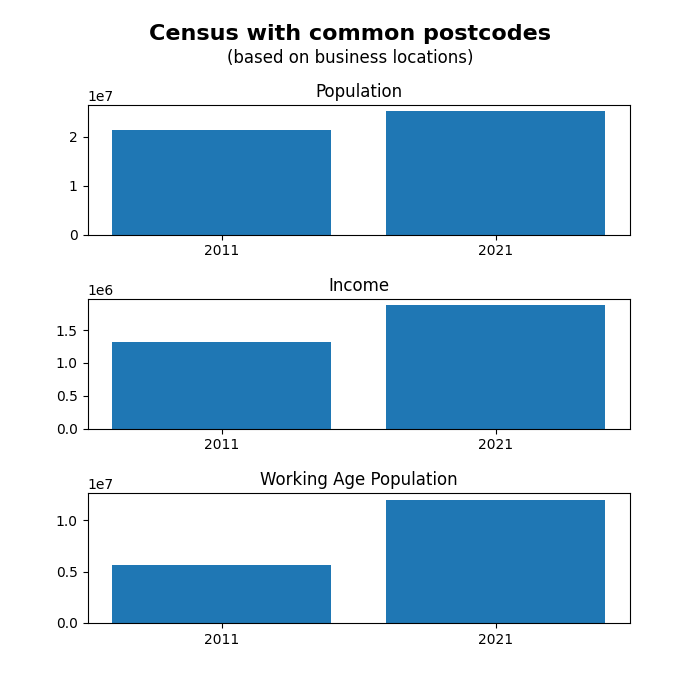
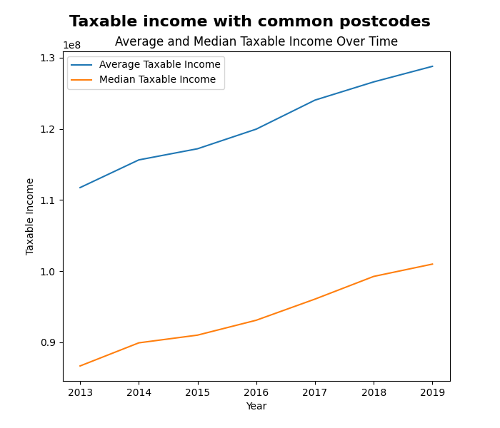
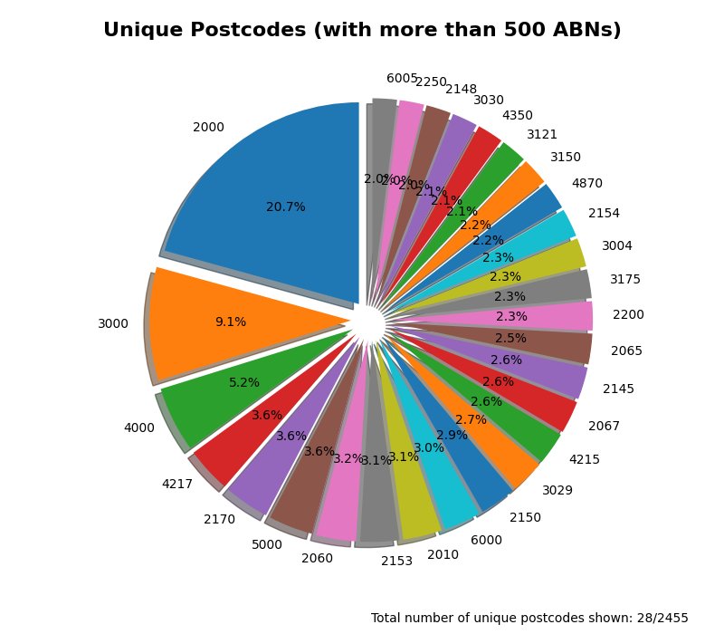

## Overview

Today is the last time I have to write a blog entry for this year, in the week that has just passed I continued with my data science assignment and have hopefully finished it well. I mostly did everything in the weekend (not that good), I delt with my big dataset, made graphs, and now finishing the report (it’s not done at time of writing). I will hopefully analyse how my hypothesis was answered in the many graphs that I made.

### What was completed

For my hypothesis I made it: *“Over time, there will be a positive increase of population growth corelated with a higher taxable income for the region (for a postcode that a business is in)”.* My thinking behind this decision was that I have many locations (postcodes), and when looking at data that was available the Census data seemed interesting. Especially because they had the 2011 and 2021, as well as linking by postcode. I then went further and found a dataset that provides the amount of taxable income for each postcode. These made the following images:

The process of dealing with the Australian Government wasn’t the easiest. I first had to spend some time finding a way to download it, but after I did that, I got to look at what was available. For the main file (over 1m entries) which was a large list of ABNs, I had to convert the XML to a more readable CSV format. In that 30-minute conversion process, I removed data that didn’t have all the columns existent, which reduced data by around 95%. For the desiccated cleaning section, I removed data that had their state missing (removed 2906 entries) this was because these were from international. A blanket 5% (i.e. every 20th) amount to keep was implemented (3,326,034 to 166,157), which means that overall, the data went from approx. 16,900,000 to a smaller 166,517. Need to reduce size because a computer can’t and shouldn’t possibly do that much graphing.

My visualisations provide a good indication that population growth is close to the average income that is taxed. The visualisation only uses places that have a business registered inside of it, and there are many of those (see figure 3). The random sampling method to reduce the size of data has provided this with some issues. It makes it harder to use the clam of ‘businesses locations’ when it is only a subset of the millions of other places. Very unlikely, but there could be a more popular post code that would mess with the places to use the Census data in (but 2000 is a very common code, 20.7% of the over 500 ABNs utilising).

## Reflection

### How was your time management?

My time management was not the best, I should have started doing things earlier. While I have done lots in the weekend, I don’t have that much time to deal with the report and finish my web dev assignment. In the future I will try to do some more things before the last weekend so that I can spend it on putting the final touches opposed to all the touches. There is a limited amount of time that is available every day and need to make use of it (in many days).

### Are you happy with your graphs?

I am mostly happy with the graphs that were made. There are some weird things that I don’t like/understand why they exist, on the line and bar chart, the Labes on the left make no sense to me other than one is bigger than the other. This is one of the things that more time would have been able to prevent (because I would have been able to research why and fix it).

### What did you learn?

I learnt many things, some in the immediate past, and other things from the whole year. The main recurring theme was about time, but other things were simply learning more about coding. Some of the things like working out how to solve a problem are very beneficial for everything, no matter the programming language. Another thing that I leaned was how to visualize data without using Excel and being able to use lots more data.
