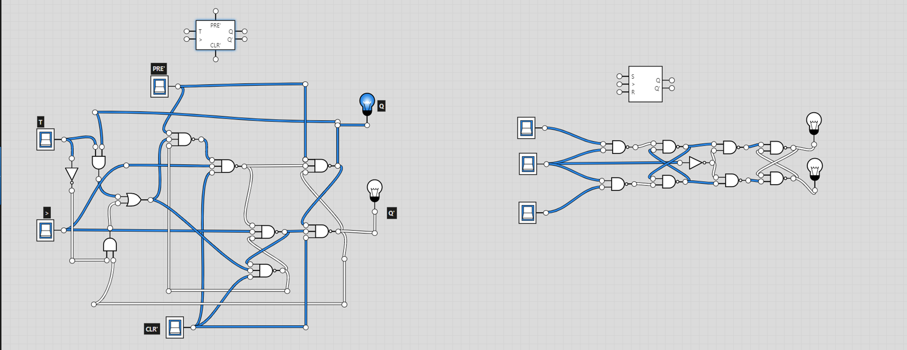

Over the last week, I’ve been trying to understand Logic Circuits. I have learned that they are simple, in theory, but when flip flops get added it starts getting confusing. I even tried to make them myself! (used Google for inspiration). It works but it’s not very good and probably not well optimized. These examples below are a `T Flip-Flop` and a `SR Flip-Flop` respectively.

`T Flip-Flop`'s are a clocked flip-flop whose output “toggles”, (ie. changes the logic state, on every iteration clock signal). They can be used for a light switch, it will change the light on and off depending on last press. `SR Flip-Flop`'s are a flip-flop that uses memory whose output is a dependant on the input value, (state and reset, ie. makes data then resets it). They can be used for storing data, they set the data to be stored then reset it and set new data.

---

I would say I have improved my understanding of logic circuits, but I still need to fully understand them. Though I don't think I put my best effort into it, I think this was because school was just getting started again and I wasn't in the mindset yet. I believe we are studding this because it will help when coding and doing different operations, as can be visualized easily.
