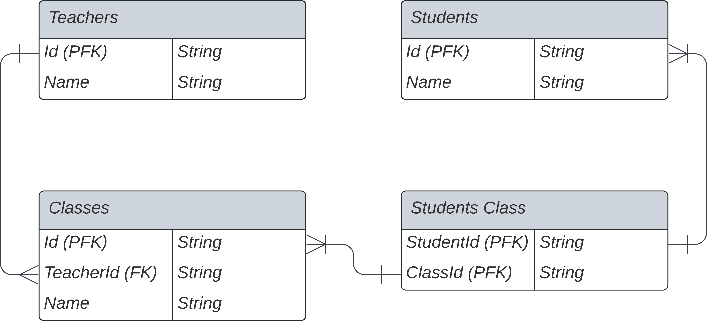

## Overview

Like data science, you must be  reading this post and wondering when I am going to tell you all about this week in web dev. When reading this you may think I did data science work because I was doing stuff with data. I learned about relational databases so that we can store user data from our websites that will be made. So, the main difference is that for web dev we are using SQL to help our websites and then the user’s, but data science is analyzing that data (which means that this is still useful)

### What was completed

To start with, a relational database is a collection of data items organized as a set of formally-described tables from which data can be accessed or made in many different ways without having to reorganize the tables or the data every time (I hope you already knew this because otherwise… you will be confused still).

To help us understand how relational databases can be used, we were tasked to make one with some requirements:

1. You need to make a system to help with timetabling
2. There are Teachers, Students and Classes in the school
3. Each class has only one teacher
4. Classes can have any number of students

I had troubles trying to get the arrows the right way around. I had to research what each do, and after talk to the teacher about it, he gave me some pointers and then I fixed those (this was repeated a few times). I also only added the minimum of data in the table (as I felt that it was out of the scope of the task/ or I wasn’t bothered enough). Overall, I did do the required task and it features the required information. But if you don’t understand what is happening in this database, there is the class table where it contains a teacher and a name, this is used in the table of students classes with the students (this table happens for each student, and with each of their classes).

## Reflection

### How did I hinder others?

For the question of did I hinder others and how, I would say that I didn’t do that much that could have impacted them. I could have tried a bit more to try and get them to stop being distracted with random things, so that is something that I will consider next week. I also could have explained what I had done with my ER diagram, but since they hadn't gotten up to that part yet I could have confused them (and thus not helping them)

### What lessons were learned from failure?

The lessons that were learned from when I failed were to ask questions when in doubt. This is true for most subjects, but more when trying to understand something (that seems confusing). It is helpful when I could try to explain what I understand and for them (the others/ teacher) to say that I am correct or tell me why that is incorrect, this is something that Google doesn’t help with (even with heaps of pages read).

### What frustrated you?

The most frustrating this was the things needed to have a lesson learnt, these were getting the connections correct (the symbols). Luckily I did ask questions because I got confused, but it was frustrating trying to understand the many symbols that can link columns on a database in an ER diagram. It was also frustrating to think that I finally understood it to be told that it is close but not fully correct (and to be fair I am still confused to an extent)
