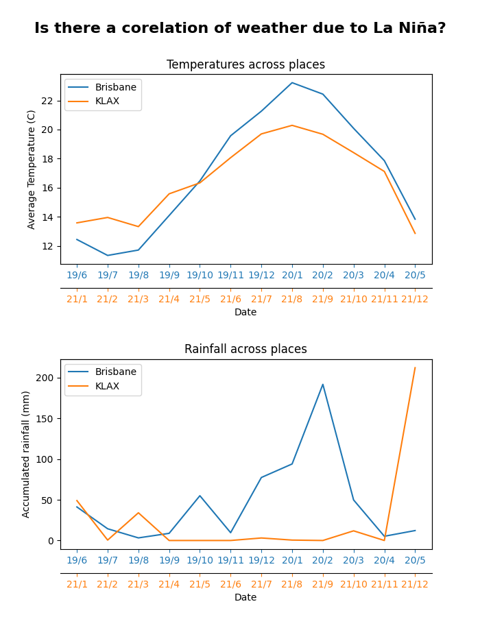

This week is basically a continuation from last week (the week that we got the assignment), this past week I used the data (that was hard to get) to make a good-looking graph. I had to read up on how to show the data in an actually useful way, this includes adding just enough data (not too much or not enough) and showing it in a useful way to support my hypothesis.

Because my question was comparing 2 places for a topic that happens at a different time for them, I had to plot different dates on the same graph. This wasn’t that hard to do once I realized how to do it. Basically what I did was plotting the first data source (Brisbane), and then making a twin plot which gets plotted from the second data (LA airport). It annoys me how simple it is, but how long it took me to make it work how I imagined it. [[code](https://github.com/Michael-Schoo/Data-Visualization/blob/main/src/__main__.py#L30-L50)]

As you also see, I have used list comprehension to make the code look cleaner. There are many options that I could have done instead of what I have done, the closest is making a variable and then just passing it into the plot function, another way is to make a function that contains an actual for loop. But I think the list comprehension way is the best, because of the things that I have chosen, the [`__main__.py`](https://github.com/Michael-Schoo/Data-Visualization/blob/main/src/__main__.py) file is actually relatively small, I separated the fetching of data, the cleaning function, and my types (not really useful). Some could say that I have unnecessarily added bloat to the code by adding types, since python doesn’t have named types (unlike TypeScript) the only way for me to type the data was to put it into a class (instead of a named dictionary which isn't possible).

```python
# set basic data
plt.title("Temperatures across places")
plt.ylabel("Average Temperature (C)")

# add first data (Brisbane - BOM)
plot1, = plt.plot([f"{str(data.year).removeprefix('20')}/{str(data.month)}" for data in better_data_bris], [data.temp for data in better_data_bris], label="Brisbane", color="C0")
plt.tick_params(colors="C0", axis="x")

# add second data (Klax - US)
twin = plt.twiny(plt)
plot2, = twin.plot([f"{str(data.year).removeprefix('20')}/{str(data.month)}" for data in better_data_klax], [data.temp for data in better_data_klax], label="KLAX", color="C1", )
twin.tick_params(colors="C1", axis="x")

# Add the second's ticks underneath first data
twin.xaxis.set_ticks_position("bottom")
twin.xaxis.set_label_position("bottom")
twin.spines["bottom"].set_position(("outward", 25))

# add legend & other basic data
plt.xlabel("Date")
plt.legend(handles=[plot1, plot2], loc="upper left")
```

<!--  -->


---

It's frustrating trying to make the graph look up to its full potential (as said earlier), that is because Matplotlib has a lot of fancy tools to show it well, and that trying to find all the options isn't the easiest with Python not having as good type systems (at least compared to TS).  There was a sense of worry that what I have done might be over the top and unnecessary. However, I felt proud/happy when I had made it (the current form) after the long time spend on making the graph, it was also good when I showed it to the teacher, and he said it looks clean and what he would have imagined it to look like. There are still some thinks to improve on the looks, but my time needs to be spent on the report part of the assignment. I also need to code comment (I seem to do it at last minute when required), that is because otherwise the teacher won't be able to understand my code as good. The resources (aka previous week’s tasks) that were useful were the ones that walked through how to make the graph and then manipulate it to look good. Without these I would have been more reliant on Google and could have had a worse result because not good background knowledge of it.

**TL;DR:** _Did more plotting, looks good enough. Need to do the report next week_
